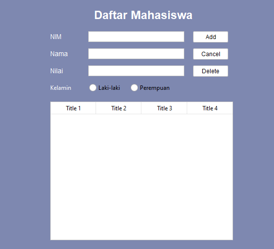
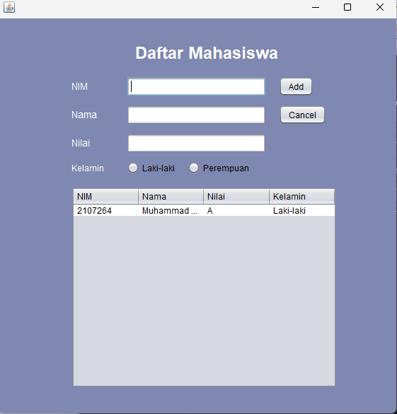

## Janji
Saya Muhammad Fikri Kafilli NIM 2107264 mengerjakan soal Latihan 5
dalam mata kuliah Desain Pemrograman Berorientasi Objek untuk keberkahanNya
maka saya tidak melakukan kecurangan seperti yang telah dispesifikasikan.
Aamiin.

# Tugas LATIHAN5DPBO2023
Download this starter project: [Starter Project](https://drive.google.com/file/d/1TEnEay74nhGcSS9PPzQcxksIlaQhTiZ2/view?usp=sharing) 
## Spesifikasi tugas
* Add more property (component type: any, except text field)
* Add method to reset form
* Refresh table after update and delete
* Add confirmation prompt before delete
* Build project (generate .jar file)

File README berisi desain program, penjelasan alur, dan dokumentasi saat program dijalankan (screenshot/screen record)

Submit link repository pada form berikut: [Form Pengumpulan](https://forms.gle/rvb1hKxbQVuYNbhKA) 

## Desain Program
Terdapat 2 class:
* Mahasiswa
* Menu

Class `Mahasiswa` :
* **NIM** -> NIM mahasiswa, (`string`)
* **Nama** -> Nama mahasiswa, (`string`)
* **Nilai** -> Nilai mahasiswa, (`string`)
* **gender** -> Gender mahasiswa, (`string`)

Class `Menu` :
* **Set Tabel** -> Mengeset Tabel untuk ditampilkan, (`void`)
* **Insert Data** -> Menambah data, (`void`)
* **Update Data** -> mengubah data yang dipilih, (`void`)
* **Delete Data** -> menghapus data yang dipilih, (`void`)
* **Reset Form** -> Mereset Form, (`void`)

_Semua Class diatas dilengkapi dengan setter dan getternya_

## Design GUI

## Alur Program Program GUI

User bisa mengisi data nim, nama, dan nilai yang berupa text field dan kelamin yang berupa radio button lalu menekan button `add` untuk menambahkannya kedalam tabel. untuk mengosongkan textfield dan radio button, user bisa menekan button `cancel`. Untuk menghapus data, user bisa memilih data dari tabel yang mau dihapus lalu menekan button `delete`. Untuk menghapus data, user bisa memilih data dari tabel yang mau diubah, lalu ubah data dari textfield atau radio button kemudian menekan button `update`.

## Dokumentasi
**JAR FILE**

**Confirm Delete Data**

**Tambah Data**

**Ubah Data**

